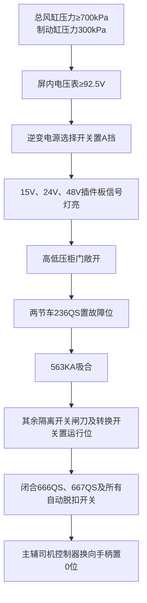
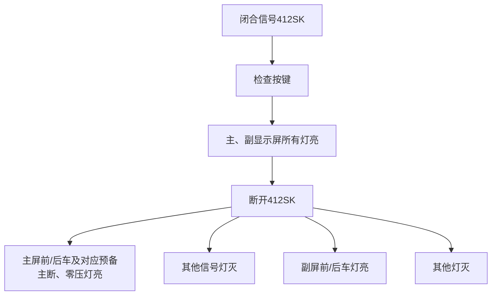
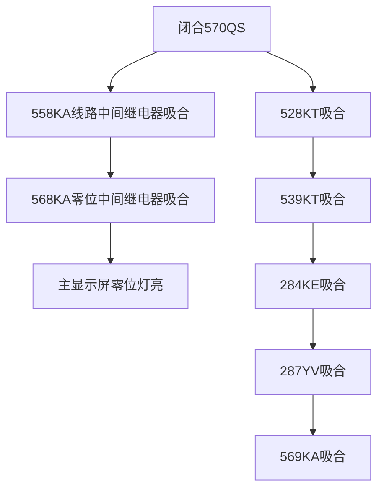
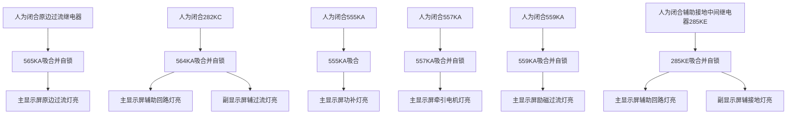
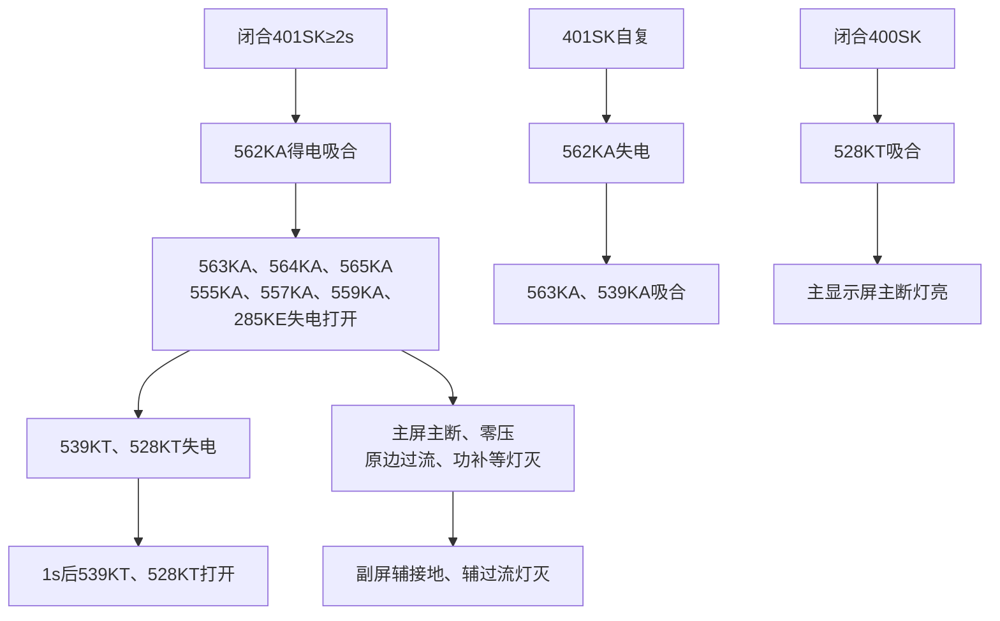
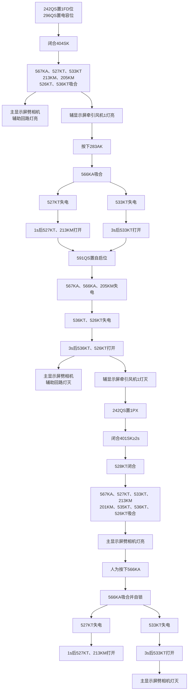
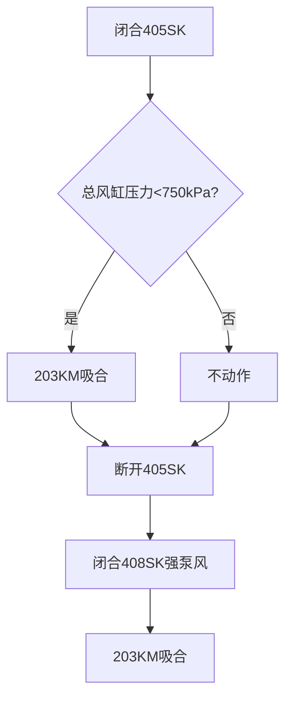
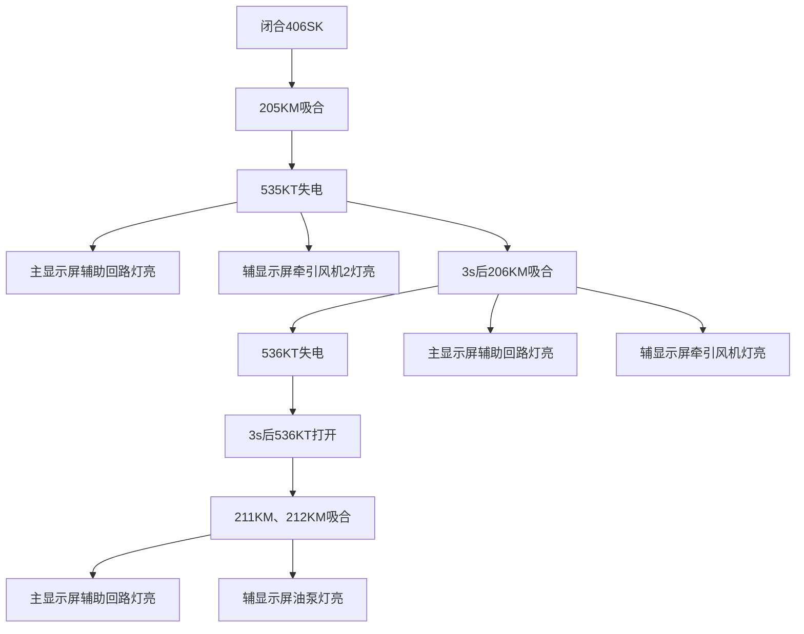
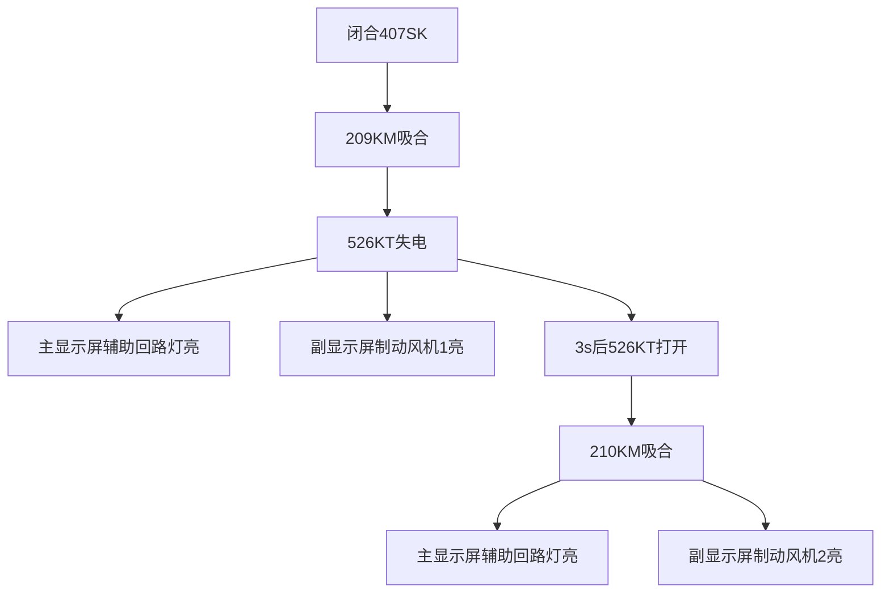
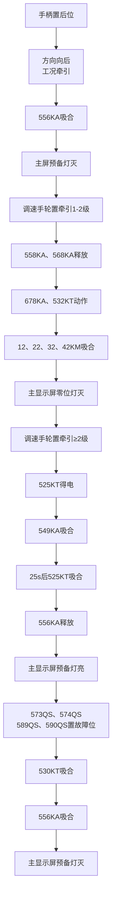

# 低压试验

## 一、准备要求

1. 总风缸压力不低于 `700kPa`，制动缸压力 `300kPa`。
2. 屏内电压表不低于 `92.5V`。
   - 逆变电源选择开关置A挡。
   - `15V、24V、48V`插件板信号灯亮，将高低压柜门敞开。
3. 两节车`236QS`置故障位，`563KA`[^563KA]吸合，其余各隔离开关闸刀及转换开关均置于运行位；闭合前节车`666QS、667QS`[^666QS]及所有自动脱扣开关。
4. 主辅司机控制器换向手柄置“0”位。

[^563KA]: 零压中间继电器
[^666QS]: 蓄电池闸刀

## 二、信号试验

1. 闭合信号`412SK`，检查按键。
   - 主、副显示屏所有灯亮。
2. 断开`412SK`。
   - 主屏前/后车及相对应的`预备\主断\零压`灯亮，其他信号灯灭。
   - 副屏前/后车灯亮，其他灯灭。

## 三、司机台钥匙电源开关试验

闭合司机台钥匙电源开关`570QS`。

1. 线路中间继电器`558ka`[^558KA]，`零位中间继电器`568KA`[^568KA]得电吸合，主显示屏零位灯亮。
2. 自启劈相机中间继电器`528KT`[^528KT]、主断控制延时继电器`539KT`[^539KT]、辅接地继电器`284KE`[^284KE]、保护阀`287YV`[^287YV]、电钥匙互锁继电器`569KA`[^569KA]吸合。

[^558KA]: 线路中间继电器
[^568KA]: 零位中间继电器
[^528KT]: 自启劈相机中间继电器
[^539KT]: 主断控制延时继电器
[^284KE]: 辅接地继电器
[^287YV]: 保护阀
[^569KA]: 电钥匙互锁继电器

## 四、保护电路试验

1. 人为闭合原边过流继电器。
   - 原边过流中间继电器`565KA`[^565KA]得电吸合并自锁。
   - 主显示屏原边过流灯亮。

2. 人为闭合辅助过流继电器`282KC`[^282KC]。
   - 辅助过流中间继电器`564KA`[^564KA]得电吸合并自锁。
   - 主显示屏辅助回路灯亮，副显示屏辅过流灯亮。

3. 人为闭合PFC过载中间继电器`555KA`[^555KA]。
   - `555KA`得电吸合，主显示屏功补灯亮。

4. 人为闭合牵引电机过流中间继电器`557KA`[^557KA]。
   - `557KA`得电吸合并自锁，主显示屏牵引电机灯亮。

5. 人为闭合励磁过流中间继电器`559KA`[^559KA]。
   - `559KA`得电吸合并自锁，主显示屏励磁过流灯亮。

6. 辅助接地中间继电器`285KE`[^285KE]。
   - `285KE`得电吸合并自锁，主显示屏辅助回路灯亮，副显示屏辅接地灯亮。

[^565KA]: 原边过流中间继电器
[^282KC]: 辅助过流继电器
[^564KA]: 辅助过流中间继电器
[^555KA]: PFC过载中间继电器
[^557KA]: 牵引电机过流中间继电器
[^559KA]: 励磁过流中间继电器
[^285KE]: 辅助接地中间继电器

## 五、主断路器试验

1. 闭合主断路器合按键开关`401SK`（不按则复），≥`2s`，恢复中间继电器`562KA`[^562KA]得电吸合；`563KA、564KA、565KA、555KA、557KA、559KA、285KE`失电打开；`539KT、528KT`失电，`1s`后`539KT、528KT`打开。

   - 主屏显示`主断，零压、原边过流、功补、牵引电机、励磁过流、辅助回路`灯灭。
   - 副显示屏`辅接地、辅过流`灯灭。

2. `401SK`自复后。
   - `562KA`失电打开，`563KA、539KA`[^539KA]得电吸合。

3. 闭合主断路器分`400SK`。
   - `528KT`得电吸合，主显示屏`主断`灯亮。

[^562KA]: 恢复中间继电器
[^539KA]: 主断控制继电器

## 六、劈相机试验

1. 将劈相机隔离开关`242QS`[^242QS]置于1FD位，`296QS`[^296QS]置电容位。

2. 闭合劈相机按键开关`404SK`。
   - 劈相机中间继电器`567KA`[^567KA]、时间继电器`527KT`[^527KT]、劈相机时间继电器`533KT`[^533KT]、起动电阻接触器`213KM`[^213KM]、牵引风机接触器`205KM`[^205KM]、制动风机时间继电器`526KT`[^526KT]、牵引风机2时间继电器`536KT`[^536KT]得电吸合。
   - 主显示屏劈相机、辅助回路灯亮，辅显示屏牵引风机1灯亮。

3. 人为按下劈相机起动继电器`283AK`[^283AK]。
   - 劈相机起动中间继电器`566KA`[^566KA]得电吸合，`527KT`失电，`1s`后`527KT、213KM`打开；`533KT`失电，`3s`后`533KT`打开。

4. 将自启劈相机隔离开关`591QS`[^591QS]置于自启位。
   - `567KA、566KA、205KM`失电打开；`536KT、526KT`失电，`3s`后`536KT、526KT`打开。
   - 主显示屏`劈相机辅助回路`灯灭，辅显示屏`牵引风机1`灯灭。

5. 将`242QS`置于“1PX”位。

6. 闭合`401SK`≥`2s`。
   1. 主断闭合`1s`后`528KT`闭合。
   2. `567KA、527KT、533KT、213KM`、劈相机接触器`201KM`[^201KM]、`535KT`[^535KT]、`536KT、526KT`得电吸合。
   3. 主显示屏劈相机信号灯亮。

   人为按下`566KA`。
   4. `566KA`吸合并自锁，`527KT`失电，`1s`后`527KT、213KM`打开；`533KT`失电，`3s`后`533KT`打开。
   5. 主显示屏劈相机显示灯灭。

[^242QS]: 劈相机隔离开关
[^296QS]: 劈相机电容隔离开关
[^567KA]: 劈相机中间继电器
[^527KT]: 时间继电器
[^533KT]: 劈相机时间继电器
[^213KM]: 起动电阻接触器
[^205KM]: 牵引风机接触器
[^526KT]: 制动风机时间继电器
[^536KT]: 牵引风机2时间继电器
[^283AK]: 劈相机起动继电器
[^566KA]: 劈相机起动中间继电器
[^591QS]: 自启劈相机隔离开关
[^201KM]: 劈相机接触器
[^535KT]: 牵引风机1时间继电器

## 七、空气压缩机试验

1. 闭合压缩机按键开关`405SK`。
   - 总风缸压力`<750kPa`时，压缩机电机接触器`203KM`[^203KM]吸合。

2. 断开`405SK`，闭合强泵风按键`408SK`，`203KM`吸合。

[^203KM]: 压缩机电机接触器

## 八、牵引风机试验

闭合通风机按键开关`406SK`。

1. 牵引风机电机接触器`205KM`吸合，`535KT`失电，主显示屏`辅助回路`灯亮，辅显示屏`牵引风机2`灯亮。

2. `3s`后`535KT`牵引风机2电机接触器`206KM`[^206KM]吸合，`536KT`失电，主显示屏辅助回路灯亮，辅显示屏牵引风机灯亮。

3. `3s`后`536KT`打开，变压器风机电机接触器`211KM`[^211KM]、油泵电机接触器`212KM`[^212KM]吸合，主显示屏`辅助回路`灯亮，辅显示屏`油泵`灯亮。

[^206KM]: 牵引风机2电机接触器
[^211KM]: 变压器风机电机接触器
[^212KM]: 油泵电机接触器

## 九、制动风机试验

闭合制动风机`407sk`[^407SK]

1. 制动风机1电机接触器`209km`[^209KM]吸合`526kt`失电，主显示屏显示`辅助回路`副显示屏显示制动风机1亮。
2. 3s后`526kT`打开制动风机2，电机接触器`210km`[^210KM]吸合。主显示屏显示`辅助回路`辅显示屏`制动风机2亮。

[^407SK]: 制动风机按键开关
[^209KM]: 制动风机1电机接触器
[^210KM]: 制动风机2电机接触器

## 十、司机控制器627AC试验

手柄置后位。

1. 两位置转换开关 方向——向后 工况牵引。
2. 预备中间继电器`556kA`[^556KA]吸合。
3. 主屏显示`预备`灯灭。

将调速手轮置牵引1-2级。

1. `558KA 568KA`释放零位失电中间继电器，`678KA`[^678KA]零位延时中间继电器`532kT`[^532KT]。
2. 电机线路接触器(`12 22 32 42km`)[^12KM]吸合。
3. 主显示屏显示零位灯灭。

将调速手轮置牵引≥2级。

1. 低级电子时间继电器`525kT`[^525KT]得电自起风机中间继电器`549KA`[^549KA]吸合。
2. `25s` `525kT`吸合，`556KA`释放，主显示屏预备灯亮。

将牵引风1、2隔离开关`573QS`[^573QS]，牵引风速3、4隔离开关`574QS`[^574QS]，制动风速1隔离开关`589Qs`[^589QS]，制动风速2隔离开关`590QS`[^590QS]置于故障位。

1. 风速时间继电器`530kt`[^530KT]吸合，`556KA`吸合。
2. 主显示屏预备灯灭。

[^556KA]: 预备中间继电器
[^678KA]: 零位延时中间继电器
[^532KT]: 零位延时时间继电器
[^12KM]: 电机线路接触器
[^525KT]: 低级电子时间继电器
[^549KA]: 自起风机中间继电器
[^573QS]: 牵引风1、2隔离开关
[^574QS]: 牵引风速3、4隔离开关
[^589QS]: 制动风速1隔离开关
[^590QS]: 制动风速2隔离开关
[^530KT]: 风速时间继电器

> [!WARNING]
> ### 以下为整理内容(非原始背诵的东西)

# 低压试验继电器动作表

## 一、准备阶段

| 编号    | 名称/作用      | 动作条件              | 动作结果 |
| ------- | -------------- | --------------------- | -------- |
| `563KA` | 零压中间继电器 | 两节车`236QS`置故障位 | 吸合     |

---

## 二、司机台钥匙电源

| 编号    | 名称/作用            | 动作条件                      | 动作结果                   |
| ------- | -------------------- | ----------------------------- | -------------------------- |
| `558KA` | 线路中间继电器       | 闭合司机台钥匙电源开关`570QS` | 得电吸合                   |
| `568KA` | 零位中间继电器       | 闭合`570QS`                   | 得电吸合，主显示屏零位灯亮 |
| `528KT` | 自启劈相机中间继电器 | 闭合`570QS`                   | 吸合                       |
| `539KT` | 主断控制延时继电器   | 闭合`570QS`                   | 吸合                       |
| `284KE` | 辅接地继电器         | 闭合`570QS`                   | 吸合                       |
| `287YV` | 保护阀               | 闭合`570QS`                   | 吸合                       |
| `569KA` | 电钥匙互锁继电器     | 闭合`570QS`                   | 吸合                       |

---

## 三、保护电路

| 编号    | 名称/作用              | 动作条件                       | 动作结果                                                 |
| ------- | ---------------------- | ------------------------------ | -------------------------------------------------------- |
| `565KA` | 原边过流中间继电器     | 人为闭合原边过流继电器         | 得电吸合并自锁，主显示屏原边过流灯亮                     |
| `564KA` | 辅助过流中间继电器     | 人为闭合辅助过流继电器`282KC`  | 得电吸合并自锁，主显示屏辅助回路灯亮，副显示屏辅过流灯亮 |
| `555KA` | PFC过载中间继电器      | 人为闭合PFC过载中间继电器      | 得电吸合，主显示屏功补灯亮                               |
| `557KA` | 牵引电机过流中间继电器 | 人为闭合牵引电机过流中间继电器 | 得电吸合并自锁，主显示屏牵引电机灯亮                     |
| `559KA` | 励磁过流中间继电器     | 人为闭合励磁过流中间继电器     | 得电吸合并自锁，主显示屏励磁过流灯亮                     |
| `285KE` | 辅助接地中间继电器     | 人为闭合辅助接地中间继电器     | 得电吸合并自锁，主显示屏辅助回路灯亮，副显示屏辅接地灯亮 |

---

## 四、主断路器

| 编号    | 名称/作用              | 动作条件                     | 动作结果       |
| ------- | ---------------------- | ---------------------------- | -------------- |
| `562KA` | 恢复中间继电器         | 闭合主断路器合按键`401SK`≥2s | 得电吸合       |
| `563KA` | 零压中间继电器         | 主断恢复过程                 | 失电打开       |
| `564KA` | 辅助过流中间继电器     | 主断恢复过程                 | 失电打开       |
| `565KA` | 原边过流中间继电器     | 主断恢复过程                 | 失电打开       |
| `555KA` | PFC过载中间继电器      | 主断恢复过程                 | 失电打开       |
| `557KA` | 牵引电机过流中间继电器 | 主断恢复过程                 | 失电打开       |
| `559KA` | 励磁过流中间继电器     | 主断恢复过程                 | 失电打开       |
| `285KE` | 辅助接地中间继电器     | 主断恢复过程                 | 失电打开       |
| `539KT` | 主断控制延时继电器     | 主断恢复过程                 | 失电，1s后打开 |
| `528KT` | 自启劈相机中间继电器   | 主断恢复过程                 | 失电，1s后打开 |
| `563KA` | 零压中间继电器         | `401SK`自复后                | 得电吸合       |
| `539KA` | 主断控制继电器         | `401SK`自复后                | 得电吸合       |

---

## 五、劈相机

| 编号    | 名称/作用            | 动作条件    | 动作结果       |
| ------- | -------------------- | ----------- | -------------- |
| `567KA` | 劈相机中间继电器     | 闭合`404SK` | 得电吸合       |
| `527KT` | 时间继电器           | 闭合`404SK` | 得电吸合       |
| `533KT` | 劈相机时间继电器     | 闭合`404SK` | 得电吸合       |
| `213KM` | 起动电阻接触器       | 劈相机启动  | 吸合           |
| `205KM` | 牵引风机接触器       | 劈相机启动  | 吸合           |
| `526KT` | 制动风机时间继电器   | 劈相机启动  | 吸合           |
| `536KT` | 牵引风机2时间继电器  | 劈相机启动  | 吸合           |
| `566KA` | 劈相机起动中间继电器 | 按下`283AK` | 得电吸合并自锁 |
| `527KT` | 时间继电器           | `566KA`吸合 | 失电，1s后打开 |
| `533KT` | 时间继电器           | `566KA`吸合 | 失电，3s后打开 |
| `201KM` | 劈相机接触器         | 主断闭合后  | 得电吸合       |

---

## 六、空气压缩机

| 编号    | 名称/作用        | 动作条件                       | 动作结果 |
| ------- | ---------------- | ------------------------------ | -------- |
| `203KM` | 压缩机电机接触器 | 闭合`405SK`且总风缸压力<750kPa | 吸合     |
| `203KM` | 压缩机电机接触器 | 闭合强泵风按键`408SK`          | 吸合     |

---

## 七、牵引风机

| 编号    | 名称/作用            | 动作条件    | 动作结果 |
| ------- | -------------------- | ----------- | -------- |
| `205KM` | 牵引风机电机接触器   | 闭合`406SK` | 吸合     |
| `535KT` | 牵引风机2时间继电器  | `205KM`动作 | 失电     |
| `206KM` | 牵引风机2电机接触器  | 3s后        | 吸合     |
| `536KT` | 牵引风机2时间继电器  | `206KM`动作 | 失电     |
| `211KM` | 变压器风机电机接触器 | 3s后        | 吸合     |
| `212KM` | 油泵电机接触器       | 3s后        | 吸合     |

---

## 八、制动风机

| 编号    | 名称/作用           | 动作条件    | 动作结果 |
| ------- | ------------------- | ----------- | -------- |
| `209KM` | 制动风机1电机接触器 | 闭合`407SK` | 吸合     |
| `526KT` | 制动风机时间继电器  | `209KM`动作 | 失电     |
| `210KM` | 制动风机2电机接触器 | 3s后        | 吸合     |

---

## 九、司机控制器627AC

| 编号    | 名称/作用          | 动作条件             | 动作结果 |
| ------- | ------------------ | -------------------- | -------- |
| `556KA` | 预备中间继电器     | 手柄置后位，工况牵引 | 吸合     |
| `558KA` | 线路中间继电器     | 调速手轮牵引1-2级    | 释放     |
| `568KA` | 零位中间继电器     | 调速手轮牵引1-2级    | 释放     |
| `678KA` | 零位延时中间继电器 | 调速手轮牵引1-2级    | 动作     |
| `532KT` | 零位延时继电器     | 调速手轮牵引1-2级    | 动作     |
| `525KT` | 低级电子时间继电器 | 调速手轮牵引≥2级     | 得电     |
| `549KA` | 自起风机中间继电器 | `525KT`动作          | 吸合     |
| `530KT` | 风速时间继电器     | 风速隔离开关故障位   | 吸合     |